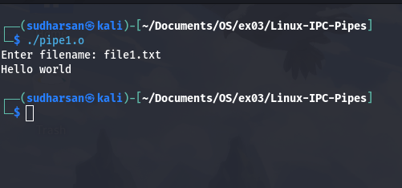

# Linux-IPC--Pipes
Linux-IPC-Pipes


# Ex03-Linux IPC - Pipes

# AIM:
To write a C program that illustrate communication between two process using unnamed and named pipes

# DESIGN STEPS:

### Step 1:

Navigate to any Linux environment installed on the system or installed inside a virtual environment like virtual box/vmware or online linux JSLinux (https://bellard.org/jslinux/vm.html?url=alpine-x86.cfg&mem=192) or docker.

### Step 2:

Write the C Program using Linux Process API - pipe(), fifo()

### Step 3:

Testing the C Program for the desired output. 

# PROGRAM:

## C Program that illustrate communication between two process using unnamed pipes using Linux API system calls
```
#include <stdio.h>
#include <stdlib.h>
#include <sys/types.h> 
#include <sys/stat.h> 
#include <string.h> 
#include <fcntl.h> 
#include <unistd.h>
#include <sys/wait.h>

void server(int rfd, int wfd); 
void client(int wfd, int rfd); 

int main() { 
    int p1[2], p2[2]; 
    pid_t pid;

   
    if (pipe(p1) == -1 || pipe(p2) == -1) {
        perror("pipe failed");
        exit(1);
    }

    pid = fork(); 
    if (pid < 0) {
        perror("fork failed");
        exit(1);
    }

    if (pid == 0) { 
      
        close(p1[1]); 
        close(p2[0]); 
        server(p1[0], p2[1]); 
        exit(0);
    } 

  
    close(p1[0]); 
    close(p2[1]);
    client(p1[1], p2[0]); 
    
    wait(NULL); 
    return 0; 
} 

void server(int rfd, int wfd) { 
    int n; 
    char fname[2000]; 
    char buff[2000];

  
    n = read(rfd, fname, sizeof(fname) - 1);
    if (n <= 0) {
        perror("server: failed to read filename");
        return;
    }
    fname[n] = '\0';

    int fd = open(fname, O_RDONLY);
    if (fd < 0) { 
        char *errmsg = "can't open\n";
        write(wfd, errmsg, strlen(errmsg));
    } else { 
        while ((n = read(fd, buff, sizeof(buff))) > 0) {
            write(wfd, buff, n); 
        }
        close(fd);
    } 
}

void client(int wfd, int rfd) {
    int n; 
    char fname[2000];
    char buff[2000];

    printf("Enter filename: ");
    fflush(stdout);


    if (scanf("%s", fname) != 1) {
        perror("client: failed to read filename");
        exit(1);
 
    write(wfd, fname, strlen(fname) + 1); 

  
    while ((n = read(rfd, buff, sizeof(buff))) > 0) {
        write(1, buff, n); 
    }
}


```

## OUTPUT


## C Program that illustrate communication between two process using named pipes using Linux API system calls
```
#include <stdio.h>
#include <stdlib.h>
#include <unistd.h>
#include <fcntl.h>
#include <sys/types.h>
#include <sys/stat.h>
#include <string.h>
#include <sys/wait.h>
#include <errno.h>

#define FIFO_FILE "/tmp/my_fifo"
#define FILE_NAME "hello.txt"

void server();
void client();

int main() {
    pid_t pid;

 
    if (mkfifo(FIFO_FILE, 0666) == -1) {
        if (errno != EEXIST) {
            perror("mkfifo failed");
            exit(EXIT_FAILURE);
        }
    }

    pid = fork();

    if (pid > 0) {
     
        sleep(1);
        server();

        wait(NULL);

    
        unlink(FIFO_FILE);

    } else if (pid == 0) {
       
        client();
    } else {
        perror("Fork failed");
        exit(EXIT_FAILURE);
    }

    return 0;
}


void server() {
    int fifo_fd, file_fd;
    char buffer[1024];
    ssize_t bytes_read;

   
    file_fd = open(FILE_NAME, O_RDONLY);
    if (file_fd == -1) {
        perror("Error opening hello.txt");
        exit(EXIT_FAILURE);
    }

 
    fifo_fd = open(FIFO_FILE, O_WRONLY);
    if (fifo_fd == -1) {
        perror("Error opening FIFO for writing");
        close(file_fd);
        exit(EXIT_FAILURE);
    }

    
    while ((bytes_read = read(file_fd, buffer, sizeof(buffer))) > 0) {
        if (write(fifo_fd, buffer, bytes_read) == -1) {
            perror("Error writing to FIFO");
            break;
        }
    }

    close(file_fd);
    close(fifo_fd);
}

void client() {
    int fifo_fd;
    char buffer[1024];
    ssize_t bytes_read;


    fifo_fd = open(FIFO_FILE, O_RDONLY);
    if (fifo_fd == -1) {
        perror("Error opening FIFO for reading");
        exit(EXIT_FAILURE);
    }

    while ((bytes_read = read(fifo_fd, buffer, sizeof(buffer))) > 0) {
        if (write(STDOUT_FILENO, buffer, bytes_read) == -1) {
            perror("Error writing to stdout");
            break;
        }
    }

    close(fifo_fd);
}


```
## OUTPUT


# RESULT:
The program is executed successfully.
